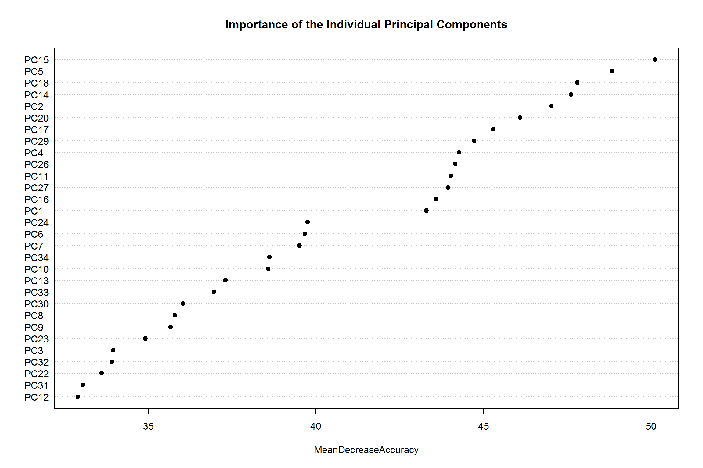

Overview
========

Using devices such as Jawbone Up, Nike FuelBand, and Fitbit it is now
possible to collect a large amount of data about personal activity
relatively inexpensively. These type of devices are part of the
quantified self movement a group of enthusiasts who take measurements
about themselves regularly to improve their health, to find patterns in
their behavior, or because they are tech geeks.

One thing that people regularly do is quantify how much of a particular
activity they do, but they rarely quantify how well they do it. In this
data set, the participants were asked to perform barbell lifts correctly
and incorrectly in 5 different ways. More information is available from
the website here: <http://groupware.les.inf.puc-rio.br/har> (see the
section on the Weight Lifting Exercise Dataset).

In this project, the goal will be to use data from accelerometers on the
belt, forearm, arm, and dumbell of 6 participants toto predict the
manner in which praticipants did the exercise.

The dependent variable or response is the "classe" variable in the
training set.

Input
=====

Download and load data.

    urls <- file.path("http://d396qusza40orc.cloudfront.net/predmachlearn", 
                      c("pml-training.csv", "pml-testing.csv"))
    trainSet <- read.csv(urls[1], na.strings=c("", "NA", "NULL"))
    testSet  <- read.csv(urls[2], na.strings=c("", "NA", "NULL"))
    rbind(dim(trainSet) , dim(testSet))

    ##       [,1] [,2]
    ## [1,] 19622  160
    ## [2,]    20  160

Data Cleaning
=============

There are a lot of columns are absolutely value-missing. Remove the
colums.

    trainSet.dena <- trainSet[, colSums(is.na(trainSet)) == 0]
    dim(trainSet.dena)

    ## [1] 19622    60

    unrelatedColumns <- c('X', 'user_name', 'raw_timestamp_part_1', 'raw_timestamp_part_2', 'cvtd_timestamp', 'new_window', 'num_window')
    trainSet.dena.dere <- trainSet.dena[, -which(names(trainSet.dena) %in% unrelatedColumns)]
    testSet.dena <- testSet[, colSums(is.na(trainSet)) == 0]
    testSet.dena.dere <- testSet.dena[, -which(names(trainSet.dena) %in% unrelatedColumns)]
    rbind(dim(trainSet.dena.dere) , dim(testSet.dena.dere))

    ##       [,1] [,2]
    ## [1,] 19622   53
    ## [2,]    20   53

For all the numeric variables, we try to find correlations amoung them
with correlation matrix, and remove the highly correlated ones.

    library(corrplot)

    ## Warning: package 'corrplot' was built under R version 3.3.1

    library(caret)

    ## Warning: package 'caret' was built under R version 3.3.1

    corMatrix <- cor(na.omit(trainSet.dena.dere[sapply(trainSet.dena.dere, is.numeric)]))
    corrplot(corMatrix, order = "FPC", method = "color", type = "lower", tl.cex = 0.8, tl.col = rgb(0, 0, 0))

    corRemover <- findCorrelation(corMatrix, cutoff = .90, verbose = TRUE)

    ## Compare row 10  and column  1 with corr  0.992 
    ##   Means:  0.27 vs 0.168 so flagging column 10 
    ## Compare row 1  and column  9 with corr  0.925 
    ##   Means:  0.25 vs 0.164 so flagging column 1 
    ## Compare row 9  and column  4 with corr  0.928 
    ##   Means:  0.233 vs 0.161 so flagging column 9 
    ## Compare row 8  and column  2 with corr  0.966 
    ##   Means:  0.245 vs 0.157 so flagging column 8 
    ## Compare row 19  and column  18 with corr  0.918 
    ##   Means:  0.091 vs 0.158 so flagging column 18 
    ## Compare row 46  and column  31 with corr  0.914 
    ##   Means:  0.101 vs 0.161 so flagging column 31 
    ## Compare row 46  and column  33 with corr  0.933 
    ##   Means:  0.083 vs 0.164 so flagging column 33 
    ## All correlations <= 0.9

    trainSet.dena.dere.decor <- trainSet.dena.dere[,-corRemover]
    testSet.dena.dere.decor <- testSet.dena.dere[,-corRemover]
    rbind(dim(trainSet.dena.dere.decor), dim(testSet.dena.dere.decor))

    ##       [,1] [,2]
    ## [1,] 19622   46
    ## [2,]    20   46

Data Partitioning
=================

We split train data into two sets, one for training, one for testing.

    library(caret)
    trainSet.indexes <- createDataPartition(y = trainSet.dena.dere.decor$classe, 
                                            p = 0.7, 
                                            list = FALSE)
    trainSet.final       <- trainSet.dena.dere.decor[trainSet.indexes,]
    validationSet.final  <- trainSet.dena.dere.decor[-trainSet.indexes,]
    rbind(dim(trainSet.final), dim(validationSet.final), dim(testSet.dena.dere.decor))

    ##       [,1] [,2]
    ## [1,] 13737   46
    ## [2,]  5885   46
    ## [3,]    20   46

Preprocess with principal component analysis (PCA). We leave important
predictors by calling predict with preprocessing object. 46th column is
the response.

    set.seed(1)
    trainProcess <- preProcess(trainSet.final[, -46], method = "pca", thresh = 0.99)
    trainSet.pc <- predict(trainProcess, trainSet.final[, -46])
    validationSet.pc <- predict(trainProcess, validationSet.final[, -46])

Training
========

We train a radom forest model.

    fit <- train(trainSet.final$classe ~ ., method = "rf", data = trainSet.pc, trControl = trainControl(method = "cv", number = 4), importance = TRUE)

    ## Warning: package 'randomForest' was built under R version 3.3.1

Let's check the important variables.

    library(randomForest)
    varImpPlot(fit$finalModel, sort = TRUE, type = 1, pch = 19, col = 1, cex = 1, main = "Importance of the Individual Principal Components")

Assessment
==========

As we are using radom forest, there is no need to do parameter tuning.
Here, we test the model with final radom forest model and calculate the
accuracy and error rate.

    validationSet.prediction <- predict(fit, validationSet.pc)
    matrix <- confusionMatrix(validationSet.final$classe, validationSet.prediction)
    matrix$table

    ##           Reference
    ## Prediction    A    B    C    D    E
    ##          A 1669    1    3    1    0
    ##          B   30 1102    5    0    2
    ##          C    3   16  996   10    1
    ##          D    2    4   47  911    0
    ##          E    0    1    6    4 1071

    accuracy <- unname(matrix$overall[1]) * 100
    errorRate <- 100 - unname(accuracy)
    c(accuracy = accuracy, error_rate = errorRate)

    ##   accuracy error_rate 
    ##   97.68904    2.31096

Conclusion
==========

    testSet.pc <- predict(trainProcess, testSet.dena.dere.decor[, -46])
    answers <- predict(fit, testSet.pc)
    answers

    ##  [1] B A B A A E D B A A B C B A E E A B B B
    ## Levels: A B C D E
